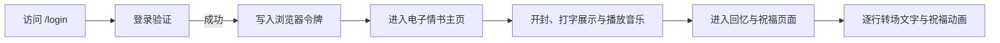
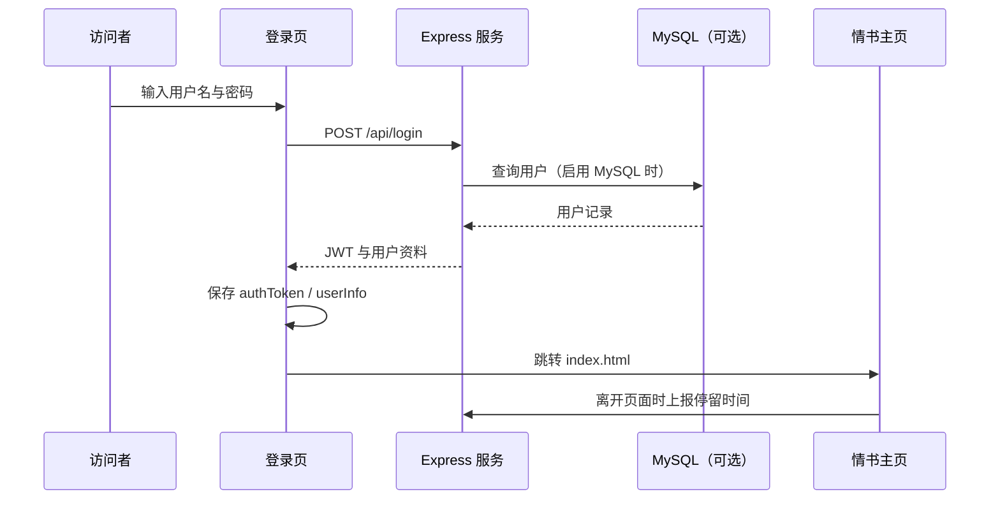
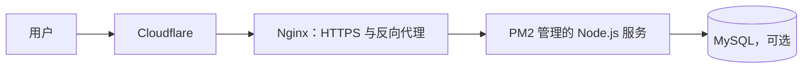

# XiaoJiaWen · eLuvLetter

> 此项目为我大二时喜欢的一位名叫肖佳雯的女孩所创建
> 项目地址：<https://github.com/qwerwv/XiaoJiaWen/tree/main>

## 项目介绍

此项目名为 **eLuvLetter**。它不是一张普通的网页贺卡，而是一段按步骤展开的情感体验：访问者先通过登录页进入网站，再亲手打开一封带樱花、音乐、信封翻转和打字动画的电子情书，最后进入回忆与祝福页面。

我把静态前端页面和 Node.js 后端放在同一个项目中部署。这样既能保留完整的视觉展示，也能提供登录校验、访问记录、页面停留统计和健康检查等服务能力。

## 我设计的访问流程




## 页面展示

### 1. 登录页

访问地址：`/login` 或 `/login.html`

我在登录页使用了全屏循环视频背景，并叠加漂浮粒子、爱心元素和半透明的玻璃拟态登录卡片。页面包含用户名和密码输入框、账户提示、加载状态以及登录成功后的过渡动画。

登录成功后，我会把后端返回的 `authToken` 与用户信息保存到浏览器的 `localStorage`，显示约两秒的“正在进入”转场，再跳转到 `index.html`。

视频资源在 `vido/video_2000380511.mp4`。为了兼容浏览器自动播放限制，我在自动播放失败时增加了用户首次点击后重试的逻辑；视频无法加载时，页面会退化为渐变色背景。

### 2. 情书主页

访问地址：`/` 或 `/index.html`

这是项目的核心页面。我使用 Canvas/WebGL 绘制樱花飘落背景，并做了带邮票、火漆封口和信纸翻转效果的 3D 信封。

用户点击火漆后，信封会打开，信纸内容通过 Typed.js 以逐字打字机动画显示。信件内容显示完成后，页面会自动追加“下一页”按钮，用户可以进入回忆页。

主页还包含循环背景音乐和播放/暂停按钮，并支持在信纸内容区域用鼠标滚轮阅读长文本。

为了让每封信都能快速定制，我没有把称呼、正文和署名固定写在页面中，而是通过 `font/content.json` 加载。该文件提供以下字段：

| 字段 | 用途 |
| --- | --- |
| `recipient` | 信封收件人 |
| `sender` | 信封/返回区域显示的寄件人 |
| `salutation` | 情书称呼 |
| `body` | 情书正文，支持打字停顿标记与 HTML 换行 |
| `signature` | 署名 |
| `title` | 浏览器页面标题 |
| `bgm` | 背景音乐地址或 Base64 音频 |

因此，在不修改主要前端逻辑的情况下，只更新 `content.json` 就能生成另一封个性化电子情书。

### 3. 回忆与祝福页

访问地址：`/page2.html`

这一页以固定背景图片 `img/beijng1.jpeg` 为基础，加入暗色遮罩、半透明卡片和渐显动画。我在页面中放置了“温馨回忆”“时光如歌”“情意绵绵”“永恒记忆”“心灵寄语”等回忆文案。

点击“下一页”后，页面会切换到黑色转场背景，逐行显示回忆文字，并生成随机祝福语和装饰元素。文字展示完成后，用户可以使用鼠标滚轮回看前面的内容；页面右上角可以返回情书主页。

## 前后端连接方式



后端入口是 `server.js`，我使用 Express 托管页面和静态资源，并在同一服务中提供 API。主要技术包括：

- Node.js + Express：服务端与静态资源托管
- bcrypt：密码哈希校验
- jsonwebtoken：登录后签发 JWT
- mysql2：可选的 MySQL 用户与日志存储
- cors：跨域来源控制
- express-rate-limit：API 限流
- dotenv：环境变量配置
- PM2：生产环境进程管理

## API 说明

| 接口 | 用途 | 我在服务端的处理方式 |
| --- | --- | --- |
| `POST /api/login` | 登录 | 校验用户名和密码，通过 bcrypt 比对密码哈希；成功后生成有效期 24 小时的 JWT。 |
| `GET /api/verify` | 校验登录令牌 | 从 `Authorization: Bearer <token>` 读取并验证 JWT。 |
| `POST /api/logout` | 登出 | 当前返回成功结果；未来可扩展令牌黑名单。 |
| `GET /api/status` | 服务状态 | 返回版本、时间和服务运行状态。 |
| `GET /health` | 健康检查 | 返回 HTTP 200，方便部署平台与监控系统探测。 |
| `GET /api/access-logs?limit=100` | 查询访问记录 | 从 MySQL 或内存读取最近日志。 |
| `POST /api/page-duration` | 页面停留统计 | 前端离开页面时用 `navigator.sendBeacon` 优先上报。 |
| `POST /api/page-event` | 页面事件统计 | 接收事件名、页面路径、时间和附加数据。 |
| `GET /api/page-stats` | 页面统计汇总 | 返回按页面聚合的访问次数与平均停留时间。 |

## 数据与日志

我为项目保留了两种运行方式：

- 配置 `DB_TYPE=mysql` 时，服务会连接 MySQL，并自动创建 `users` 和 `access_logs` 表。用户数据与访问记录会持久化在数据库中。
- 未配置 MySQL 时，服务使用内置内存用户和内存日志，便于快速演示。此时重启服务会清空内存记录，但访问日志仍会写入 `logs/access_YYYY-MM-DD.log`。

为了尽量获取真实访问来源，启用 Cloudflare 代理后，服务会优先读取 `cf-connecting-ip` 和 `x-forwarded-for` 等请求头。

## 项目结构

```text
XiaoJiaWen/
├─ index.html                 # 情书主页
├─ login.html                 # 登录页
├─ page2.html                 # 回忆/祝福页
├─ server.js                  # Express 服务与 API
├─ config.js                  # 服务、数据库和安全配置
├─ css/                       # 页面样式、信封和登录视觉效果
├─ js/                        # 樱花、信件动画、统计脚本等
├─ img/                       # 邮票、火漆、纹理和背景图片
├─ vido/                      # 登录页背景视频
├─ font/content.json          # 可定制的信件内容与背景音乐
├─ DEPLOYMENT.md              # 生产部署说明
└─ DEBUG_GUIDE.md             # 本地调试说明
```

## 本地开发

我在 `package.json` 中提供了常用脚本：

```bash
npm install
npm start        # 直接运行 server.js
npm run dev      # 使用 Nodemon 开发模式
```

开发文档中的示例服务地址是：

- 主页：`http://localhost:9091/`
- 登录页：`http://localhost:9091/login`
- API：`http://localhost:9091/api`
- 健康检查：`http://localhost:9091/health`

我还通过环境变量控制服务端口、域名、HTTPS、Cloudflare 代理、JWT、CORS 白名单和数据库连接信息，例如 `PORT`、`DOMAIN`、`JWT_SECRET`、`ALLOWED_ORIGINS` 与 `DB_*`。

## 生产部署

生产环境中，我建议使用以下链路：



部署文档以 Ubuntu 24.04、Node.js 18、Nginx、PM2 和 UFW 为基础。Nginx 对外处理 80/443 端口，Node.js 服务在内部端口运行；PM2 用于守护进程、查看日志和开机自启。

## 当前需要继续完善的部分

这个项目已经具备完整的展示体验，后续我将完成以下优化：

- 统一登录页 API 地址、开发端口和服务端配置，优先使用环境变量或相对路径，避免不同环境指向错误服务。
- 为主页内容、访问日志和页面统计接口添加 JWT/管理员鉴权。当前静态页面与部分统计接口不应直接对所有访问者开放。
- 删除仓库内可能被误用的示例凭据，使用未提交的 `.env` 保存真实密码、数据库配置和 JWT 密钥。
- 补充正式的 `README.md`，包括项目截图、快速开始、部署步骤和配置示例。
- 统一仓库 LICENSE 与 `package.json` 内许可证字段，避免 Apache-2.0 与 MIT 两种声明并存。

## 总结

我的结局，她告诉我她只把我当朋友，说以后仍可以朋友的身份相处，我拒绝了
我希望此项目可以帮助到你，祝你表白成功！！！！！！！
eLuvLetter 能把一封私人信件从“阅读内容”变成“经历过程”：先进入、再开封、听音乐、看文字，最后在回忆和祝福中结束，将高压的表白转换成一场叙事，一种层层递进的表达，也可用于告别
项目既保留了可快速替换内容的前端结构，也为后续登录、数据统计和生产部署预留了后端基础。

## 忠告

最后，不要后悔你做出的任何决定和选择，不被喜欢的姑娘喜欢，是一件很伤心的事情，但天并没有塌下来，该怎么活还得怎么活。
"真正的喜欢，不是占用，而是成全"
